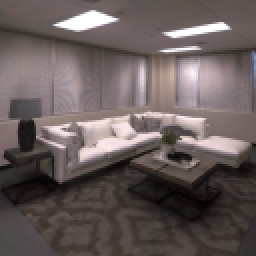
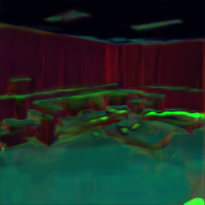

# Robustness via Cross-Domain Ensembles [ICCV 2021, Oral]

This repository contains tools for training and evaluating:

- [Pretrained models](#pretrained-models)
- [Demo code](#quickstart)
- [Training scripts](#training)
- [Docker and installation instructions](#installation)

for the paper: [**Robustness via Cross-Domain Ensembles**](https://crossdomain-ensembles.epfl.ch).

[](https://crossdomain-ensembles.epfl.ch)

<table>
      <tr><td><em>Above: An overview of the proposed method for creating a robust and diverse ensemble of predictions. A set of networks predict a target domain (surface normals) given an input image that has undergone an unknown distribution shift (JPEG compression degradation), via K middle domains (e.g. 2D texture edges, low-pass filtering, greyscale image, emboss filtering, etc). The prediction by each of the K paths are then merged into one final strong prediction using weights that are based on the uncertainty associated with each prediction. This method is shown to be significantly robust against adversarial and non-adversarial distribution shifts. In the figure above, solid and dashed arrows represent learned and analytical functions, respectively.</em></td></tr>
</table>

---

Table of Contents
=================

   * [Introduction](#introduction)
   * [Installation](#installation)
   * [Quickstart (demo code)](#quickstart)
   * [Download all pretrained models](#pretrained-models)
   * [Train a model](#training)
     * [Instructions for training](#steps)
     * [To train on a new middle domain](#to-train-from-new-middle-domain)
     * [To train on other datasets](#to-train-on-other-datasets)
     * [CIFAR-100 classification (quickstart)](#training-cifar-100)
   * [Citing](#citation)


## Introduction
**Robustness problem in neural networks:** Neural networks deployed in the real-world will encounter data with naturally occurring distortions, e.g. motion blur, brightness changes, etc. Such changes make up shifts from the training data distribution. While neural networks are able to learn complex functions in-distribution, their predictions are deemed unreliable under such shifts, i.e. they are not robust. This presents a core challenge that needs to be solved for these models to be useful in the real-world.

**Why do we need robust predictions?** Suppose we want to learn a mapping from an input domain, e.g. RGB images, to a target domain, e.g. surface normals (see above figure). A common approach is to learn this mapping with a `direct` path, i.e. `RGB → surface normals`. Since this path directly operates on the input domain, it is prone to being affected by any slight alterations in the RGB image, e.g. brightness changes. 

**How do we obtain robust predictions?** An alternative can be to go through a **middle domain** that is invariant to that change. For example, the surface normals predicted via the `RGB → 2D edges → surface normals` path will be resilient to brightness distortions in the input as the 2D edges domain abstracts that away. However, the distortions that a model may encounter are broad and unknown ahead of time, and some middle domains can be too lossy for certain downstream predictions. These issues can be mitigated by employing an **ensemble** of predictions made via a **diverse set of middle domains** and merging their (relatively weaker) predictions into one (stronger) output on-the-fly.


### Middle and target domains

For the paper, we programmatically extracted the following middle domains from the RGB input (no learning, implementations are provided [here](https://github.com/EPFL-VILAB/XDEnsembles/blob/master/utils.py)):

    Emboss         Greyscale               Sobel Edges            Laplace Edges         
    Wavelet        Low-pass Filtered       Sharpened
    
A visualization of these middle domains for an RGB image can be seen below. 

RGB                 |  Emboss                 |  Greyscale			        |  Sobel Edges 
:--:|:--:|:--:|:--:
 |   |   |  
Laplace Edges   |  Wavelet                 |  Low-pass Filtered			        |  Sharpened  
 |  |   |  

For target domains, we use the followings from the [Taskonomy dataset](https://github.com/StanfordVL/taskonomy/tree/master/data):

    Surface Normals          Depth (Z-Buffer)            Reshading

A visualization of target domains for an RGB image can be seen below.

RGB                 |  Surface Normals			        |  Depth (Z-Buffer)          | Reshading
:--:|:--:|:--:|:--:
 |   |   |  


    
## Quickstart 

#### Download the trained networks
If you haven't yet, then download the [pretrained models](#pretrained-models). Models used for the demo can be downloaded with the following command:
```bash
sh ./tools/download_models.sh
```

This downloads the `single UNet baseline`, `deep ensembles`, and `cross-domain ensembles` models for `normal`, `reshading` and `depth_zbuffer` targets (14GB) to a folder called `./models/`. Individual models can be downloaded [here](https://drive.switch.ch/index.php/s/6dFgYwR8dGj07jF).

#### Run a model on your own (clean) image

To run the trained model of a task on a specific image:

```bash
python demo.py --task $TASK --img_path $PATH_TO_IMAGE_OR_FOLDER --output_path $PATH_TO_SAVE_OUTPUT
```

The `--task` flag specifies the target task for the input image, which should be either `normal`, `reshading` or `depth_zbuffer`.

To run the script for a `normal` target on the [example image](./assets/test.png):

```bash
python demo.py --task normal --img_path assets/test.png --output_path assets/
```

It returns the output prediction (`test_normal_ours_mean.png`) and the associated uncertainty (`test_normal_ours_sig.png`) for the proposed method as well as the single UNet baseline and deep ensembles.

#### Distorted data

You can also apply distortion to your input from [Common Corruptions](https://arxiv.org/abs/1903.12261) to see how well the models handle the distribution shift.

```bash
python demo.py --task $TASK --img_path $PATH_TO_IMAGE_OR_FOLDER --output_path $PATH_TO_SAVE_OUTPUT --distortion $DISTORTION_NAME --severity $SEVERITY_LEVEL
```

* The argument `--distortion` can be set to one of the followings: 
```bash
'shot_noise', 'speckle_noise', 'impulse_noise', 'defocus_blur', 'contrast', 'brightness','saturate', 'jpeg_compression', 'pixelate', 'spatter', 'glass_blur', 'gaussian_noise', 'gaussian_blur'
```
* The argument `--severity` can be set from 1 to 5 to change the severity of the applied distortion.

Example with `pixelate` distortion at severity 2:

```bash
python demo.py --task normal --img_path assets/test.png --output_path assets/ --distortion 'pixelate' --severity 2
```

Test image (distorted)      |            |  Baseline			      |  Deep ensembles           | Ours
:-------------------------: | :-------------------------: |:-------------------------: |:-------------------------:|:-------------------------:
      | Prediction  |   |   |  
&nbsp;        |Uncertainty|   |   |  

The distorted input is also saved as `distorted_input.png` in the output folder.

Similarly, running for target tasks `reshading` and `depth` gives the followings:

| |  Baseline (reshading)			      |  Deep ensembles (reshading)           | Ours (reshading)
|:-------------------------: | :-------------------------: |:-------------------------:|:-------------------------:
|Prediction |   |   |  
|Uncertainty |  |   |  

| |   Baseline (depth)			      |  Deep ensembles (depth)           | Ours (depth)
|:-------------------------: | :-------------------------: |:-------------------------:|:-------------------------:
|Prediction |   |   |  
|Uncertainty |  |   |  


## Pretrained models

#### Network Architecture
All networks are based on the [UNet](https://arxiv.org/pdf/1505.04597.pdf) architecture. They take in an input size of 256x256, upsampling is done via bilinear interpolations instead of deconvolutions. All models were trained with an NLL loss. Architectural hyperparameters for the models are detailed in [transfers.py](./transfers.py).


#### Download the models
The following command downloads the final pretrained models.
```bash
sh ./tools/download_models.sh
```

This downloads the `single UNet baseline`, `deep ensembles`, and `cross-domain ensembles` models for `normal`, `reshading` and `depth_zbuffer` targets (14GB) to a folder called `./models/`. Individual models can be downloaded [here](https://drive.switch.ch/index.php/s/6dFgYwR8dGj07jF).


#### Download the models from different training stages

Our method includes three training stages: baseline training, consistency training (optional), and sigma training. The pretrained models for the first two stages can be downloaded [here](https://drive.switch.ch/index.php/s/WVH91pZfgG2VnhB) (9.3GB). These models were used for the ablation studies in the paper. 

```bash
sh ./tools/download_baselines.sh
```

#### Download perceptual models
The pretrained perceptual models for the consistency training are the same as those used in [Robust Learning Through Cross-Task Consistency](https://github.com/EPFL-VILAB/XTConsistency). They can be downloaded with the following command.

```bash
sh ./tools/download_percep_models.sh
```

This downloads the perceptual models for the `normal`, `reshading` and `depth_zbuffer` targets (1.6GB). Each target has 7 pretrained models (from the other sources below).

```
Curvature         Edge-3D            Reshading
Depth-ZBuffer     Keypoint-2D        RGB       
Edge-2D           Keypoint-3D        Surface-Normal 
```

Perceptual model architectural hyperparameters are detailed in [transfers.py](./transfers.py), and some of the pretrained models were trained using L2 loss. For using these models with the provided training code, the pretrained models should be placed in the file path defined by `MODELS_DIR` in [utils.py](./utils.py#L25).

Individual perceptual models can be downloaded [here](https://drive.switch.ch/index.php/s/aXu4EFaznqtNzsE).


#### Download other baselines
We also provide the models for other baselines used in the paper. The pretrained baselines can be downloaded [here](https://drive.switch.ch/index.php/s/ep2j3s8nC7QoqWV) and the architectural details can be reached from [transfers.py](./transfers.py). Note that we will not be providing support for them. 
- A full list of baselines is in the table below:
   |                     Baseline Method                     |                                                       Description                                                              |   
   |---------------------------------------------------------|--------------------------------------------------------------------------------------------------------------------------------|
   | Baseline UNet [[PDF](https://arxiv.org/pdf/1505.04597.pdf)]   | UNets trained on the Taskonomy dataset.                                                                                  | 
   | Baseline UNet + Adversarial training [[PDF](https://arxiv.org/pdf/1706.06083.pdf)]   | Baseline UNets (above) were finetuned with adversarial examples using I-FGSM (details can be reached from the paper).                                                                                  | 
   | Multi-Task [[PDF](http://arxiv.org/pdf/1609.02132.pdf)] | A multi-task model we trained using UNets, using a shared encoder (similar to [here](http://arxiv.org/pdf/1609.02132.pdf)) to predict normal, reshading, and depth from the RGB input.     |
   | Multi-Domain |  Instead of a single input domain, we use all the [middle domains](#middle-and-target-domains) and RGB as inputs, and output the prediction for a single task.  |

## Installation

There are two convenient ways to run the code. Either using Docker (recommended) or using a Python-specific tool such as pip, conda, or virtualenv.

#### Installation via Docker [Recommended]

We provide a docker that contains the code and all the necessary libraries. It's simple to install and run.
1. Simply run:

```bash
docker run --runtime=nvidia -ti --rm ofkar/xdensembles:latest
```
The code is now available in the docker under your home directory (`/XDEnsembles`), and all the necessary libraries should already be installed in the docker.

#### Installation via Pip/Conda/Virtualenv
The code can also be run using a Python environment manager such as Conda. See [requirements.txt](./requirements.txt) for complete list of packages. We recommend doing a clean installation of requirements using virtualenv:
1.  Clone the repo:
```bash
git clone https://github.com/EPFL-VILAB/XDEnsembles.git
cd XDEnsembles
```

2. Create a new environment and install the libraries:
```bash
conda create -n testenv -y python=3.6
source activate testenv
pip install -r tools/requirements.txt
apt-get update && apt-get -y install libmagickwand-dev && apt-get -y install libgl1-mesa-glx
git clone https://github.com/fbcotter/pytorch_wavelets && cd pytorch_wavelets && pip install .
```


## Training

Assuming that you want to train on the full dataset or [on your own dataset](#to-train-on-other-datasets), read on.

Note that there are 3 stages of training: **1.** baseline training, **2.** consistency training (optional), and **3.** sigma training. The pretrained models for the first two stages are provided [here](#download-the-models-from-different-training-stages) and the final models [here](#download-the-models).

#### Code structure
```python
config/             # Configuration parameters: where to save results, etc.
    split.txt           # Train, val split
    jobinfo.txt         # Defines job name, base_dir
modules/            # Network definitions
train_baseline.py   # Script for baseline training 
train_cons.py       # Script for consistency training
train_sig.py        # Script for sigma training
train_merging.py    # Script for merging training
dataset.py          # Creates dataloader
energy_baseline.py  # Defines path config, computes total loss, plots for baseline training
energy_cons.py      # Defines path config, computes total loss, logging for consistency training
energy_sig.py       # Defines path config, computes total loss, logging for sigma training
energy_merging.py       # Defines path config, computes total loss, logging for merging training
models.py           # Implements forward backward pass
graph.py            # Computes path defined in energy.py
task_configs.py     # Defines task specific preprocessing, masks, loss fn
transfers.py        # Loads models
utils.py            # Defines file paths (described below), analytical operations to get middle domains
distortions.py      # Implemementations of common corruptions
demo.py             # Demo script
```

#### Expected folder structure
The code expects folders structured as follows. These can be modified by changing values in `utils.py`
```python
base_dir/                   # The following paths are defined in utils.py (BASE_DIR)
    shared/                 # with the corresponding variable names in brackets
        models/             # Pretrained models (MODELS_DIR)
        results_[jobname]/  # Checkpoint of model being trained (RESULTS_DIR)
        ood_standard_set/   # OOD data for visualization (OOD_DIR)
    data_dir/               # taskonomy data (DATA_DIRS)
```

### Steps

1. **Train baseline models**

* To train from RGB or one of the predefined middle domains, the command is given by

```bash
python train_baseline.py baseline_{input_domain}2{output_domain}
```

For example, to train a `emboss` to `normal` network, the command is

```bash
python train_baseline.py baseline_emboss2normal
```

This trains the model with negative log likelihood (NLL) loss. In addition to the prediction, the uncertainty is also predicted. 

#### To train from new middle domain, 
  * Add its definition in `utils.py`. The expected input and output is of size `1xCxHxW`.
  * Add the model definition in the `pretrained_transfers` dictionary in `transfers.py`. A emboss transformation that has been added to `utils.py` as `emboss_kernel` will be added as
  
  ```bash
  ('rgb', 'emboss'):
     (lambda: emboss_kernel, None),
  ```
  * In the `energy_configs` dictionary in `energy.py`, define the domains for the path. For `rgb2emboss2normal`,
  
  ```bash
      "baseline_emboss2normal": {
        "paths": {
            "x": [tasks.rgb],
            "y^": [tasks.normal],
            "n(x)": [tasks.rgb, tasks.emboss, tasks.normal],
        },
        ...
      }
  ```
  The other required configs, "loss" and "plots", remain the same.

2. **Sigma training**

The above training step returns predicted uncertainties that are _overconfident_ when given out of distribution data. In this step, train the uncertainties to generalize while holding the predictions fixed. The command is given by 

```bash
python train_sig.py trainsig_{input_domain}{output_domain}
```

To train a `emboss` to `normal` network, the command is

```bash
python train_sig.py trainsig_embossnormal
```

3. **Training with consistency (OPTIONAL)**

Training with [cross-task consistency](https://consistency.epfl.ch/) constraints is optional. The command is given by,

```bash
python train_cons.py consistency_{input_domain}{output_domain}
```

again, for a `emboss` to `normal` network, the command is

```bash
python train_cons.py consistency_embossnormal
```

This trains the target model with 4 perceptual losses: `reshading`, `curvature`, `depth`, `imagenet`. Note that for the paper, for the `depth` target models, we use 7 perceptual losses, similar to [cross-task consistency](https://consistency.epfl.ch/).

4. **Training a stacking network (OPTIONAL)**

After steps 1-3 have been done for each path, we propose to merge the predictions either by the inverse of their predicted variance or training a network to do the merging. Both options gives similar performance, thus the latter is optional. The command to train a network that takes in as input all predictions and output a single one for e.g. `reshading`, is given by,

```bash
python train_merging.py merge_reshading
```

5. **Logging** The losses and visualizations are logged in [Weights & Biases](https://www.wandb.com/).


### To train on other datasets

The expected folder structure for the data is,
```
DATA_DIRS/
  [building]_[domain]/
      [domain]/
          [view]_domain_[domain].png
          ...
```
Pytorch's dataloader _\_\_getitem\_\__ method has been overwritten to return a tuple of all tasks for a given building and view point. This is done in [datasets.py](./datasets.py#L181-L198). Thus, for other folder structures, a function to get the corresponding file paths for different domains should be defined. 

### Training CIFAR-100

Cross-domain ensembles are not limited to regression tasks. They also perform well for classification tasks such as CIFAR-100. You can try training your own CIFAR-100 models with the proposed idea using the training script in the folder `cifar-100`. This may be easier to try first since its quicker to train on CIFAR-100 dataset compared to Taskonomy. You can also reach the pretrained models [here](https://drive.switch.ch/index.php/s/qa5D8XAA6MZPfnC).

* To train from RGB or one of the predefined middle domains, the command is given by

```bash
python train.py -domain $DOMAIN_NAME -net $ARCH_NAME
```

For example, to train a CIFAR-100 classifier with `emboss` as a middle domain (i.e. RGB→emboss→classes) and ResNet18 model, the command is

```bash
python train.py -domain emboss -net resnet18
```

Accuracy on the test data can also be evaluated using the following command

```bash
python test.py -domain $DOMAIN_NAME -net $ARCH_NAME -weights $PATH_FOR_WEIGHTS
```

## Citation

If you find the code, models, or data useful, please cite this paper:

```
@article{yeo2021robustness,
  title={Robustness via Cross-Domain Ensembles},
  author={Yeo, Teresa and Kar, O\u{g}uzhan Fatih and Zamir, Amir},
  journal={ICCV},
  year={2021}
}
```

